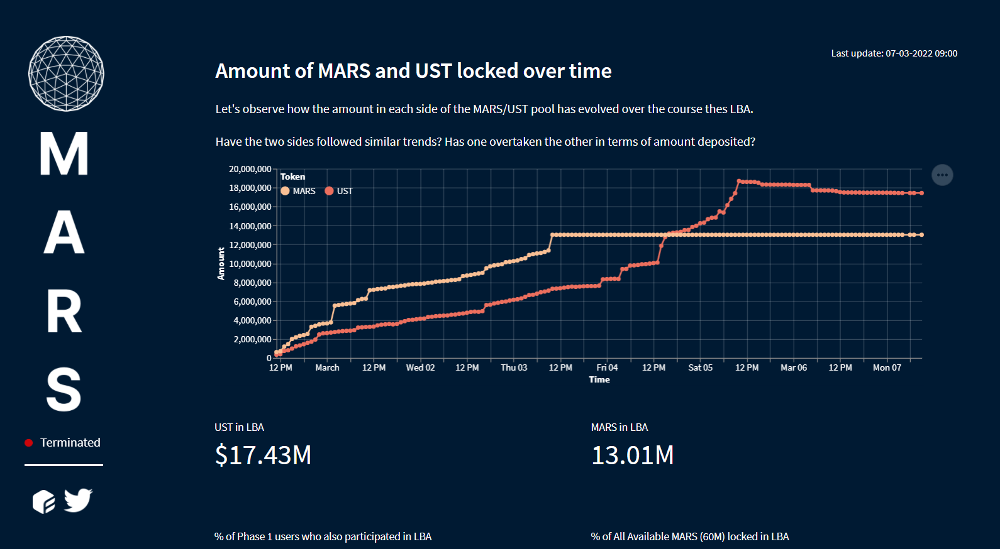
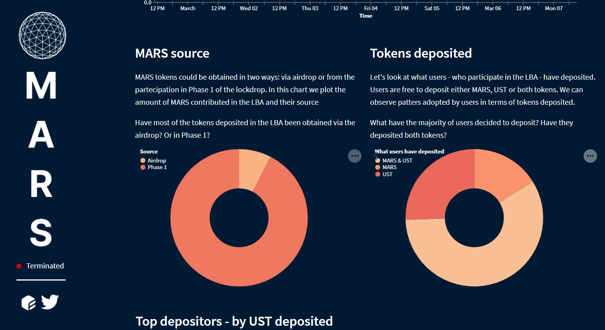
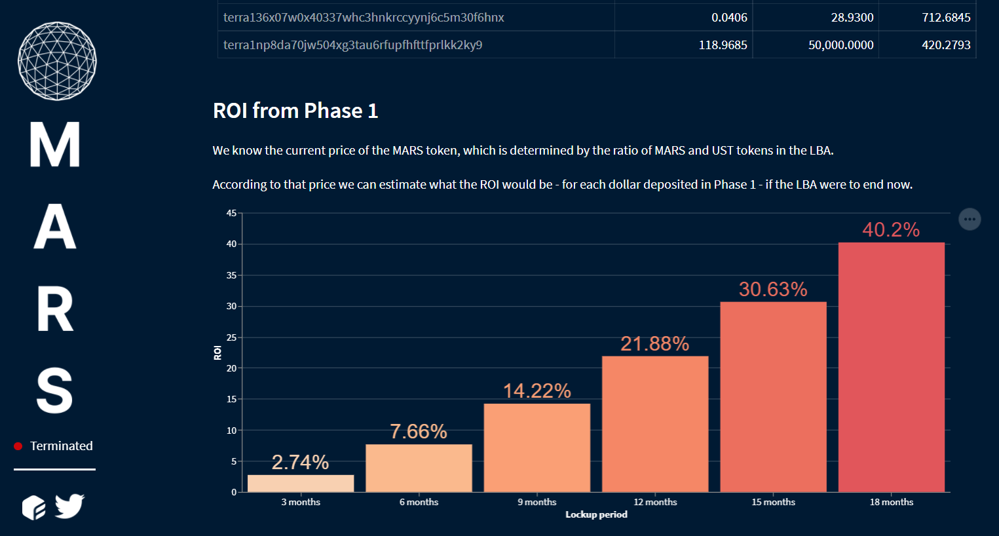

# MARS Lockdrop - Dashboard

[Mars Protocol](https://https://marsprotocol.io/) is a decentralized application developed on the Terra blockchain which allows lend and borrow assets. The application also allows for Smart-Contract-to-Smart-Contract lending and borrowing.

This repository contains the code used to develop the dashboard visualising the data from the Mars lockdrop event - the launch event of the $MARS token distributed to users locking their $UST into the Red Bank.

The dashboard uses mainly Streamlit (for the website), Pandas (data manipulation) and Altair (data viz).

The project has been supported by [flipside](https://flipsidecrypto.xyz/)

* The dashboard for the deposit phase can be found [here](https://share.streamlit.io/incioman/mars_lockdrop) (if it is still online)

* The dashboard for the LBA (Liquidity Bootstrapping Auction) phase can be found [here](https://marslockdrop.herokuapp.com/) (if it is still online)

In case the websites are not online anymore, here are some screenshots of the dashboard

**------**

**------**

You can see the official Tweet announcing the dashboard [here](https://twitter.com/flipsidecrypto/status/1495828255882063877?s=20&t=XuA1vWptJVGTkNuSbLLWQw).